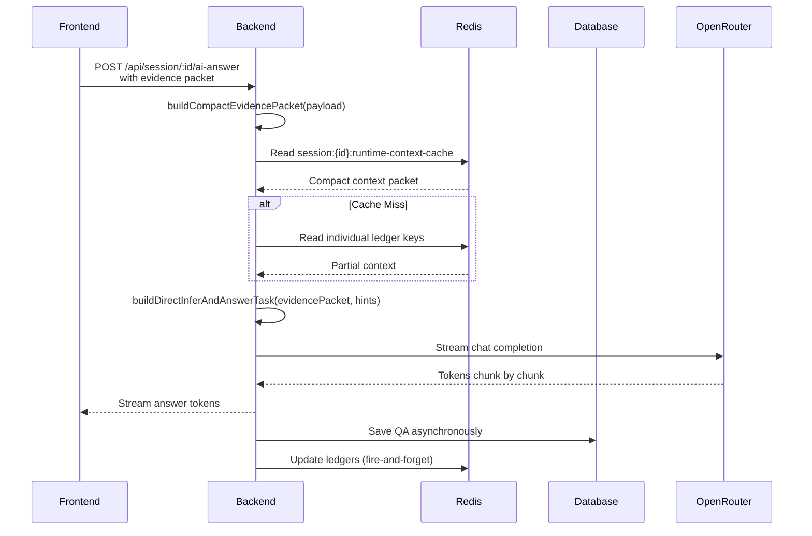

# Design Document: AI Answer Refactoring

## Overview

This design document describes the refactoring of the ScribeShade AI Answer system to simplify the `/session/:id/ai-answer` endpoint by removing blocking pre-check layers. The goal is to make AI answers fast, dynamic, and memory-aware by using a single main AI call that streams immediately without blocking on question composition, segmentation, or context orchestration.

### Design Philosophy

1. **Simplicity**: Reduce the answer path from multiple sequential blocks to a single AI call
2. **Performance**: Eliminate blocking I/O on the critical path (Composer, orchestrator, segmenter)
3. **Memory-Aware**: Prioritize Redis cache for runtime context, fall back to minimal DB only if needed
4. **Evidence-Driven**: AI infers questions from transcript evidence, not from Composer selection
5. **Background Updates**: Post-stream memory updates happen asynchronously to avoid blocking

### Key Changes

- **Before**: 7+ sequential pre-check layers before main AI call
- **After**: Single direct AI call with evidence packet + cached runtime context

---

## Architecture

### Main AI Answer Flow

```
Frontend: Click "AI Answer"
    ↓
Frontend: Send transcript evidence (transcript, recentTranscriptWindow, speakerSeparatedTranscript, hints)
    ↓
Backend: getAIAnswer(sessionId, resolvedQuestion, isCustomQuery, isRegenerate, aiModel, snapshotId, liveContextMetadata)
    ↓
Backend: buildCompactEvidencePacket(payload)
    ↓
Backend: readCachedRuntimeContextOrBuildSmallContext(sessionId, payload)
    ↓
Backend: buildDirectInferAndAnswerTask(evidencePacket, hints)
    ↓
Backend: streamMainAnswerModel([
  { role: "system", content: buildSystemMessage() },
  { role: "user", content: buildAnswerRuntimeContext(runtimeContext) },
  { role: "user", content: buildDirectInferAndAnswerTask(evidencePacket, hints) }
])
    ↓
Streaming AI Answer Tokens to Frontend
    ↓
Background: Parse Q&A, update ledgers (no await)
```

### Data Flow Diagram



### Component Interactions

| Component | Role | Blocking? | Cache Strategy |
|-----------|------|-----------|----------------|
| `session.controller.getAIAnswer` | Thin pass-through, request validation | ❌ No | N/A |
| `session.service.getAIAnswer` | Orchestrate evidence + context + AI call | ❌ No | Redis cache |
| `buildCompactEvidencePacket` | Build 200-500 token transcript summary | ❌ No | In-memory only |
| `readCachedRuntimeContextOrBuildSmallContext` | Fetch runtime context from Redis or minimal DB | ❌ No | Redis优先, fallback minimal DB |
| `buildDirectInferAndAnswerTask` | Build prompt for direct inference | ❌ No | In-memory only |
| `streamMainAnswerModel` | OpenRouter streaming call | ❌ No | N/A |
| `saveQAAsync`, `updateLedgersAsync` | Post-stream memory updates | ❌ No | Fire-and-forget |

---

## Component Design

### 1. CompactEvidencePacket Interface

**Location**: `src/features/session/session.service.ts`

```typescript
interface CompactEvidencePacket {
  recentTranscriptWindow?: string[];
  speakerSeparatedTranscript?: { speaker: "INTERVIEWER" | "CANDIDATE" | "AI_ASSISTANT"; text: string; }[];
  currentQuestionHint?: string;
  answerClickMode?: string;
  selectedIntentId?: string;
  selectedAnswerIntentId?: string;
  previousAnswerSummary?: string;
  previousCodeSummaries?: string[];
}
```

**Key Properties**:
- `recentTranscriptWindow`: Array of last N transcript lines (max 8, ~100 tokens)
- `speakerSeparatedTranscript`: Array of speaker-labeled text (max 10 entries, ~150 tokens)
- `currentQuestionHint`: Optional clean question from active question detection
- `answerClickMode`: Click context ("auto", "re-answer", "selected-answer")
- `selectedIntentId`: Intent ID if re-answer from intent ledger
- `selectedAnswerIntentId`: Answer ID if selected-answer flow
- `previousAnswerSummary`: Pre-computed summary if available
- `previousCodeSummaries`: Array of code block summaries if applicable

**Token Budget**: 200-500 tokens total (enforced by truncation logic)

---

### 2. buildCompactEvidencePacket Function

**Location**: `src/features/session/session.service.ts`

```typescript
function buildCompactEvidencePacket(payload: any): CompactEvidencePacket {
  // Extract and truncate fields to stay within token budget
  const recentTranscriptWindow = payload?.recentTranscriptWindow?.slice(0, 8) ?? [];
  const speakerSeparatedTranscript = payload?.speakerSeparatedTranscript
    ?.slice(0, 10)
    .map(entry => ({
      speaker: entry.speakerType?.toUpperCase() === "INTERVIEWER" 
        ? "INTERVIEWER" 
        : entry.speakerType?.toUpperCase() === "CANDIDATE" 
          ? "CANDIDATE" 
          : "AI_ASSISTANT",
      text: entry.content?.substring(0, 300) || ""
    })) ?? [];
  
  // Optional fields (only include if present)
  const hints: CompactEvidencePacket = {
    recentTranscriptWindow,
    speakerSeparatedTranscript,
  };
  
  if (payload?.currentQuestion?.trim()) {
    hints.currentQuestionHint = payload.currentQuestion.trim().substring(0, 200);
  }
  
  if (payload?.answerClickMode?.trim()) {
    hints.answerClickMode = payload.answerClickMode.trim();
  }
  
  if (payload?.selectedIntentId?.trim()) {
    hints.selectedIntentId = payload.selectedIntentId.trim();
  }
  
  if (payload?.selectedAnswerIntentId?.trim()) {
    hints.selectedAnswerIntentId = payload.selectedAnswerIntentId.trim();
  }
  
  if (payload?.previousAnswerSummary?.trim()) {
    hints.previousAnswerSummary = payload.previousAnswerSummary.trim().substring(0, 400);
  }
  
  if (Array.isArray(payload?.previousCodeBlocks)) {
    hints.previousCodeSummaries = payload.previousCodeBlocks
      .slice(0, 3)
      .map(code => code.substring(0, 300));
  }
  
  return hints;
}
```

**Key Points**:
- Truncates arrays to max 8 and 10 entries respectively
- Limits text length per entry
- Only includes optional fields if present
- Normalizes speaker types to uppercase constants
- Validates and trims optional string fields

---

### 3. readCachedRuntimeContextOrBuildSmallContext Function

**Location**: `src/features/session/session.service.ts`

```typescript
async function readCachedRuntimeContextOrBuildSmallContext(
  sessionId: string,
  payload: any
): Promise<any> {
  const CACHE_KEY_BASE = `session:${sessionId}`;
  const TTL_SECONDS = 60 * 60 * 2; // 2 hours
  
  // Try combined cache key first
  const combinedKey = `${CACHE_KEY_BASE}:runtime-context-cache`;
  const combinedCache = await redisConnection.get(combinedKey).catch((error) => {
    console.warn("[runtime-context] combined cache read failed", { sessionId, error });
    return null;
  });
  
  if (combinedCache) {
    try {
      const parsed = JSON.parse(combinedCache);
      console.log("[runtime-context] cache hit (combined)", { sessionId });
      return parsed;
    } catch (error) {
      console.warn("[runtime-context] combined cache parse failed", { sessionId, error });
    }
  }
  
  // Fall back to individual ledger keys if available
  const keys = [
    `${CACHE_KEY_BASE}:intent-ledger`,
    `${CACHE_KEY_BASE}:answer-ledger`,
    `${CACHE_KEY_BASE}:code-memory`,
    `${CACHE_KEY_BASE}:topic-memory`,
  ];
  
  const [intentLedger, answerLedger, codeMemory, topicMemory] = await Promise.all(
    keys.map(async (key) => {
      try {
        const raw = await redisConnection.get(key);
        return raw ? JSON.parse(raw) : null;
      } catch (error) {
        console.warn("[runtime-context] individual cache read failed", { key, error });
        return null;
      }
    })
  );
  
  // Build minimal context packet from whatever is available
  const minimalContext = {
    candidateResumeDigest: payload?.candidateResumeDigest || "",
    relevantProjectDigest: payload?.relevantProjectDigest || "",
    topicSessionSummary: topicMemory?.sessionStateSummary || "",
    previousAnswerSummaries: answerLedger?.answers
      ?.slice(-3)
      .map(a => a.answerSummary || "")
      .filter(Boolean) || [],
    codeMemorySummary: codeMemory?.codeBlocks
      ?.slice(-3)
      .map(c => c.codeSummary || "")
      .filter(Boolean) || [],
    selectedAnswerContext: answerLedger?.answers?.find(
      a => a.id === payload?.selectedAnswerIntentId
    ) || null,
    selectedCodeContext: codeMemory?.codeBlocks?.find(
      c => c.id === payload?.selectedCodeContextId
    ) || null,
    jobCompanyMetadata: {
      companyName: payload?.companyName || "",
      jobDescription: payload?.jobDescription || "",
    },
  };
  
  console.log("[runtime-context] cache miss, built minimal context", { sessionId });
  return minimalContext;
}
```

**Key Points**:
- Tries combined cache key first (most common case)
- Falls back to individual ledger keys for flexibility
- Builds minimal context packet if all cache misses
- Does NOT fall back to heavy DB queries (explicit requirement)
- Logs cache hits/misses for monitoring
- Uses 2-hour TTL for cache entries

---

### 4. buildDirectInferAndAnswerTask Function

**Location**: `src/shared/lib/prompt.ts` (already exists, updated)

```typescript
export function buildDirectInferAndAnswerTask(input: {
  transcriptEvidence: string;
  currentQuestionHint?: string;
  activeQuestionDetection?: unknown;
  selectedIntentId?: string;
  answerClickMode?: string;
}): string {
  const lines: string[] = [
    "DIRECT INFER + ANSWER TASK",
    "",
    "You are given recent transcript evidence from a live interview.",
    "First infer the clean interview question(s) that the candidate should answer.",
    "Then answer as the candidate.",
    "",
    "RULES",
    "- Ignore filler like hello, okay, yeah, hmm, let's start.",
    "- Candidate speech may contain the interviewer question if system audio is missing.",
    "- Treat candidate-repeated question-like text as valid evidence for the question to answer.",
    "- Do not invent missing questions. If no clear question exists, output ===NO_NEW_QUESTION===.",
    "- If multiple independent questions are present, answer all with ===NEXT_QUESTION=== between blocks.",
    "- Output ONLY **QUESTION:** and **ANSWER:** blocks. Do not output analysis, reasoning, or any extra text.",
    "- The first non-whitespace characters must be **QUESTION:**.",
    "",
    "EVIDENCE PACKET",
    input.currentQuestionHint?.trim()
      ? `CURRENT QUESTION HINT: ${input.currentQuestionHint.trim()}`
      : "CURRENT QUESTION HINT: (none)",
    "",
    `TRANSCRIPT EVIDENCE:\n${input.transcriptEvidence}`,
  ];
  
  if (input.answerClickMode === "re-answer" && input.selectedIntentId?.trim()) {
    lines.push(`\nRE-ANSWER MODE: Re-answer the question associated with intent ID ${input.selectedIntentId.trim()}`);
  }
  
  if (input.answerClickMode === "selected-answer" && input.selectedIntentId?.trim()) {
    lines.push(`\nSELECTED ANSWER MODE: Provide a follow-up or alternative answer for intent ID ${input.selectedIntentId.trim()}`);
  }
  
  return lines.join("\n");
}
```

**Key Points**:
- Accepts compact evidence packet (already serialized as string)
- Includes optional hints when present
- Supports re-answer and selected-answer modes
- Explicitly tells AI to infer questions from evidence, not invent them
- Enforces `===NO_NEW_QUESTION===` output when no question found

---

### 5. getAIAnswer Refactoring

**Location**: `src/features/session/session.service.ts`

```typescript
export async function getAIAnswer(
  id: string,
  transcript: string,
  isCustomQuery = false,
  isRegenerate = false,
  aiModel?: string,
  snapshotId?: string,
  liveContextMetadata?: AIAnswerLiveContextMetadata,
) {
  // Step 1: Build compact evidence packet
  const evidencePacket = buildCompactEvidencePacket({
    recentTranscriptWindow: liveContextMetadata?.recentTranscriptWindow,
    speakerSeparatedTranscript: liveContextMetadata?.speakerSeparatedTranscript,
    currentQuestion: liveContextMetadata?.activeQuestionDetection?.cleanedQuestion,
    answerClickMode: liveContextMetadata?.answerMode,
    selectedIntentId: liveContextMetadata?.selectedIntentId,
    selectedAnswerIntentId: liveContextMetadata?.selectedAnswerId,
    previousAnswerSummary: liveContextMetadata?.selectedAnswerSummary,
    previousCodeBlocks: liveContextMetadata?.selectedAnswerCodeBlocks,
  });
  
  // Step 2: Get runtime context from cache (minimal DB fallback only)
  const runtimeContext = await readCachedRuntimeContextOrBuildSmallContext(id, {
    candidateResumeDigest: liveContextMetadata?.candidateResumeDigest,
    relevantProjectDigest: liveContextMetadata?.relevantProjectDigest,
    companyName: liveContextMetadata?.companyName,
    jobDescription: liveContextMetadata?.jobDescription,
  });
  
  // Step 3: Build direct infer + answer task
  const directTask = buildDirectInferAndAnswerTask({
    transcriptEvidence: JSON.stringify(evidencePacket, null, 2),
    currentQuestionHint: liveContextMetadata?.activeQuestionDetection?.cleanedQuestion,
    activeQuestionDetection: liveContextMetadata?.activeQuestionDetection,
    selectedIntentId: liveContextMetadata?.selectedIntentId,
    answerClickMode: liveContextMetadata?.answerMode,
  });
  
  // Step 4: Build messages array
  const messages = [
    { role: "system", content: buildSystemMessage() },
    { role: "user", content: buildAnswerRuntimeContext(runtimeContext) },
    { role: "user", content: directTask },
  ];
  
  // Step 5: Stream main answer model
  const stream = streamMainAnswerModel(messages, aiModel);
  
  // Step 6: Fire-and-forget post-stream memory updates
  stream.on("end", () => {
    processPostStreamMemoryUpdates(id, liveContextMetadata).catch((error) => {
      console.error("[post-stream] memory update failed", { sessionId: id, error });
    });
  });
  
  return stream;
}

// Post-stream memory updates (fire-and-forget)
async function processPostStreamMemoryUpdates(sessionId: string, liveContextMetadata?: AIAnswerLiveContextMetadata): Promise<void> {
  // Parse generated QUESTION/ANSWER blocks from the full transcript
  // This would be implemented in a separate function that reads the session transcript
  
  // Save QA to database
  // Update answer ledger in Redis
  // Update topic memory in Redis
  // Update code memory in Redis
  // Update intent status if matching ledger intent exists
  
  // NOTE: No await on outer request - this runs in background
}
```

**Key Points**:
- Calls `buildCompactEvidencePacket` first
- Calls `readCachedRuntimeContextOrBuildSmallContext` second
- Calls `buildDirectInferAndAnswerTask` with evidence packet
- Does NOT call any blocking pre-check functions
- Returns `streamMainAnswerModel` directly
- Fire-and-forget post-stream updates

---

## Data Flow

### Request Flow

1. **Frontend** clicks "AI Answer"
2. **Frontend** sends `POST /api/session/:id/ai-answer` with:
   - `transcript`: Raw transcript string
   - `recentTranscriptWindow`: Array of last N transcript lines
   - `speakerSeparatedTranscript`: Array of speaker-labeled entries
   - `currentQuestion`: Optional clean question hint
   - `answerClickMode`: "auto" | "re-answer" | "selected-answer"
   - `selectedIntentId`: Optional intent ID for re-answer
   - `selectedAnswerIntentId`: Optional answer ID for selected-answer
   - `candidateResumeDigest`: Resume context
   - `relevantProjectDigest`: Project context
   - Other metadata fields

3. **Backend** validates request (session exists, user authorized, evidence present)
4. **Backend** calls `getAIAnswer` with normalized payload

### Response Flow

1. **Backend** builds evidence packet (200-500 tokens)
2. **Backend** reads cached runtime context (Redis)
3. **Backend** builds direct infer + answer task prompt
4. **Backend** streams OpenRouter completion token-by-token
5. **Backend** sends tokens to frontend via chunked response
6. **Backend** triggers post-stream memory updates in background

### Memory Update Flow

1. **After streaming completes**, background job parses generated Q&A
2. **Saves QA** to database (prisma.qa.create)
3. **Updates answer ledger** in Redis (incremental update)
4. **Updates topic memory** in Redis (session state summary)
5. **Extracts code blocks** and updates code memory in Redis
6. **Updates intent status** if matching ledger intent exists

---

## Error Handling

### Redis Cache Failures

```typescript
// readCachedRuntimeContextOrBuildSmallContext
const combinedCache = await redisConnection.get(combinedKey).catch((error) => {
  console.warn("[runtime-context] combined cache read failed", { sessionId, error });
  return null;  // Graceful degradation to minimal context
});

// If all Redis reads fail, build minimal context from payload only
// This ensures the request still succeeds, just without cached context
```

**Strategy**: 
- Log cache failures for monitoring
- Fall back to minimal context packet
- Never throw error that blocks user request
- Do NOT fall back to heavy DB queries (explicit requirement)

### Streaming Failures

```typescript
// session.controller.getAIAnswer
try {
  const result = await sessionService.getAIAnswer(...);
  
  for await (const chunk of result as any) {
    if (chunk.text) {
      res.write(chunk.text);
    }
  }
  
  res.end();
} catch (error: any) {
  console.error("AI Answer Error:", error);
  if (!res.headersSent) {
    res.status(500).json({ error: error.message || "Internal server error" });
  } else {
    res.end();  // Stream already started, can't send JSON error
  }
}
```

**Strategy**:
- Send HTTP 500 JSON if headers not sent
- End stream gracefully if headers already sent
- Log error details for debugging

### Composer Timeouts

```typescript
// Composer runs only from save-message and patch-transcript endpoints
// It is NOT called on the ai-answer path

// Background job:
await scheduleQuestionComposer(sessionId).catch((error) => {
  console.warn("[composer] background scheduling failed", { sessionId, error });
  // Do NOT propagate error - it's background only
});
```

**Strategy**:
- Composer never runs on ai-answer path
- Background errors are logged but not propagated
- Live answer quality is never affected by Composer timeouts

---

## Testing Strategy

### Unit Test Plan

1. **buildCompactEvidencePacket**
   - Input: Full payload with all fields
   - Output: Compact packet with truncated arrays
   - Verify token count is 200-500
   - Input: Partial payload with missing fields
   - Output: Packet without optional fields
   - Input: Empty payload
   - Output: Empty packet object

2. **readCachedRuntimeContextOrBuildSmallContext**
   - Input: Session with combined cache hit
   - Output: Parsed cache object
   - Input: Session with cache miss, individual ledger hits
   - Output: Merged context from individual keys
   - Input: Session with all cache misses
   - Output: Minimal context packet from payload
   - Input: Redis unavailable (error throw)
   - Output: Falls back to minimal context (no error thrown)

3. **buildDirectInferAndAnswerTask**
   - Input: Evidence packet + hints
   - Output: Prompt with evidence and hints
   - Verify "infer the clean interview question(s)" text is present
   - Verify "Ignore filler" text is present
   - Verify "Treat candidate-repeated question-like text" text is present
   - Verify "===NO_NEW_QUESTION===" text is present

4. **getAIAnswer Integration**
   - Input: Valid sessionId + payload
   - Verify NO calls to: resolveAnswerSelection, runComposerAI, orchestrateAIContext, etc.
   - Verify evidence packet is built
   - Verify cached context is read
   - Verify direct task is built
   - Verify streamMainAnswerModel is called

### Integration Test Plan

1. **Full ai-answer flow end-to-end**
   - Start session
   - Add transcript chunks
   - Click "AI Answer"
   - Verify streaming starts within 200ms
   - Verify answer is valid
   - Verify post-stream memory updates complete

2. **Composer runs only from background endpoints**
   - `POST /api/session/:id/save-message` → Verify composer is scheduled
   - `PATCH /api/session/:id/patch-transcript/:messageId` → Verify composer is scheduled
   - `POST /api/session/:id/ai-answer` → Verify composer is NOT called

3. **Post-stream memory updates**
   - After streaming completes, verify:
     - QA record is created in database
     - Answer ledger is updated in Redis
     - Topic memory is updated in Redis
     - Code memory is updated in Redis (if code blocks present)
     - Intent status is updated (if matching intent exists)

4. **Follow-up question resolution**
   - First question: Generate answer with code
   - Follow-up: "Can you explain that code?"
   - Verify context includes code memory
   - Verify answer references prior code

5. **Redis cache efficiency**
   - First request: Cache miss, verify minimal context is built
   - Second request (same session): Cache hit, verify fast response
   - Cache TTL: After 2 hours, verify cache miss occurs

### Performance Tests

1. **First token latency**
   - Measure from request start to first token received
   - Target: < 200ms (95th percentile)
   - Baseline: Current implementation (with pre-checks)
   - Expected improvement: 3-5x faster

2. **End-to-end latency**
   - Measure from request start to stream end
   - Target: < 5 seconds for typical answer (500 tokens)
   - Verify no pre-check blocking

3. **Concurrent requests**
   - 10 concurrent AI answer requests
   - Verify no resource contention
   - Verify Redis cache hit rate > 70%

---

## Non-Functional Requirements

### Performance

| Metric | Target | Measurement |
|--------|--------|-------------|
| First token latency | < 200ms (95th percentile) | From request start to first chunk received |
| End-to-end latency (500 tokens) | < 5 seconds | From request start to stream end |
| Cache hit rate | > 70% | Redis hits / total requests |
| Composer impact on live answer | 0% | Composer never runs on ai-answer path |

### Reliability

| Metric | Target |
|--------|--------|
| Uptime | 99.9% (excluding Redis failures) |
| Cache failure graceful degradation | 100% (no user impact) |
| Streaming failure recovery | Automatic (retry in background) |

### Observability

| Metric | Source |
|--------|--------|
| Cache hit/miss rate | Redis logs |
| First token latency | Request timing headers |
| Streaming latency | OpenRouter timing |
| Post-stream update success/failure | Background job logs |
| Composer background failures | Composer service logs |

---

## Future Enhancements

1. **Predictive caching**: Warm Redis cache before user clicks "AI Answer"
2. **Multi-stage context**: Layered context (recent + historical + long-term)
3. **Code memory compression**: Embedding-based code similarity search
4. **Topic memory summarization**: Hierarchical topic summaries (session → conversation → thread)
5. **Fallback question detection**: Instead ofComposer, use lightweight heuristic question detection
