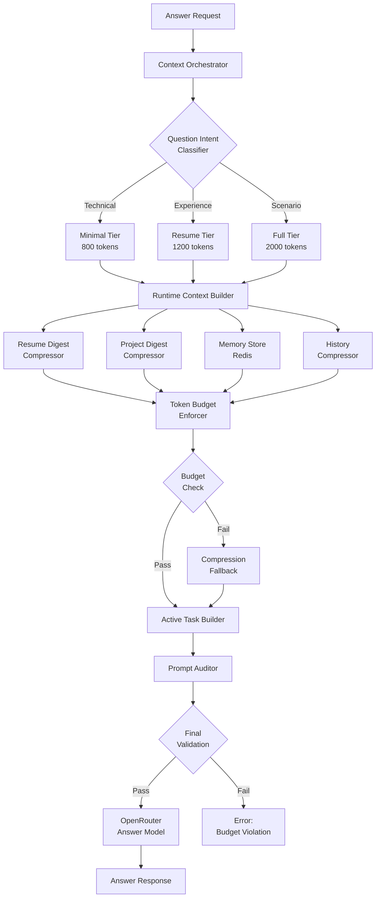
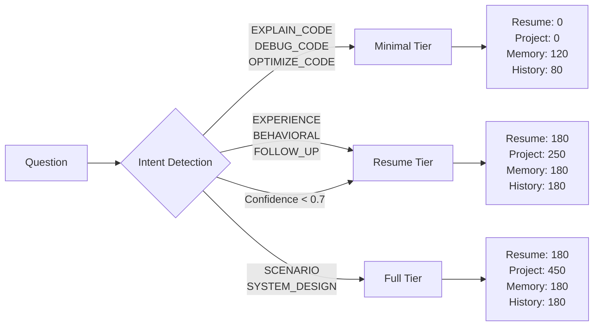
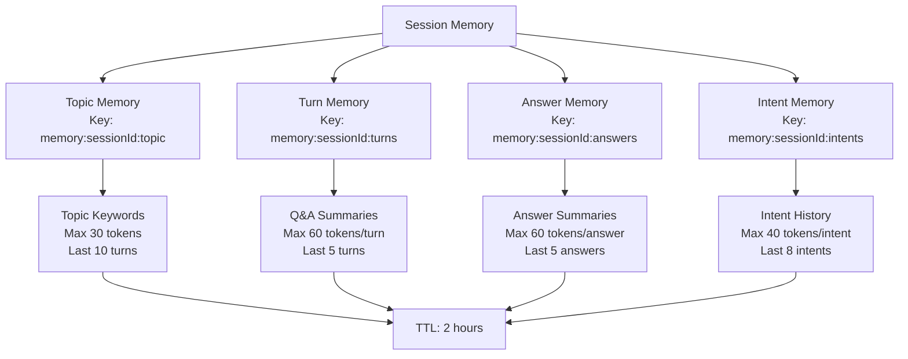

# Design Document: Prompt Optimization Phase 2

## Overview

This document specifies the technical design for refactoring ScribeShade's AI answer-generation pipeline to achieve Parakeet-level prompt efficiency. The current system suffers from excessive prompt sizes (4,000-10,000 tokens) due to runtime-context and active-task duplication, causing high API costs, increased latency, and degraded answer quality.

The refactored system targets **1,500-3,000 tokens per request** while improving answer quality, context retention, and follow-up accuracy through:

- **Strict separation** between runtime context (persistent session data) and active task (request-specific data)
- **Compression strategies** for resume, transcript, history, and memory
- **Token budget framework** with three-tier allocation (system 1200 + runtime 800 + active 400 = 2400 base + 600 margin)
- **Redis-based memory architecture** for structured conversation state
- **Context tiering** (minimal/resume/full) based on question intent
- **Automated validation** and prompt auditing before every AI call

### Design Goals

1. **Token Efficiency**: Reduce average prompt from 4000-10000 tokens to 1500-3000 tokens (60-75% reduction)
2. **Cost Reduction**: Lower OpenRouter API costs by 60-75% through smaller prompts
3. **Latency Improvement**: Reduce time-to-first-token by 200-400ms through smaller context windows
4. **Quality Preservation**: Maintain or improve answer quality and follow-up accuracy
5. **Zero Schema Changes**: Phase 1 requires no database migrations (Redis-only state)
6. **Incremental Rollout**: Support feature flags for phased migration and rollback


## Architecture

### High-Level Prompt Building Pipeline



### Context Tier Decision Flow



### Memory Architecture (Redis)




## Components and Interfaces

### 1. Context Orchestrator (Existing: `context-orchestrator.service.ts`)

**Responsibility**: Coordinates all context gathering, normalization, and compression before answer generation.

**Modifications**:
- Integrate with new `TokenBudgetEnforcer` before building context packet
- Add tier selection logic based on question intent
- Route to appropriate compressor services

**Interface**:
```typescript
type ContextOrchestrationInput = {
  sessionId: string;
  resolvedQuestion: string;
  metadata?: AIAnswerLiveContextMetadata;
  tier?: ContextTier; // NEW
};

type ContextOrchestrationResult = {
  // ... existing fields
  tier: ContextTier; // NEW
  tokenBudget: TokenBudgetAllocation; // NEW
  compressionApplied: CompressionLog[]; // NEW
};
```


### 2. Runtime Context Builder (NEW: `runtime-context-builder.service.ts`)

**Responsibility**: Assembles persistent session-level data while enforcing 800-token budget.

**Key Rules**:
- MUST NOT include current question, transcript excerpts, or segmenter metadata
- MUST enforce per-section budgets (resume 180, project 250-450, memory 180, history 180, document 120, instructions 80)
- MUST delegate to specialized compressors for each section

**Interface**:
```typescript
type RuntimeContextInput = {
  sessionId: string;
  userId: string;
  tier: ContextTier;
  isProjectQuestion: boolean;
};

type RuntimeContext = {
  resumeDigest: string;      // 120-180 tokens
  projectDigest: string;     // 0-450 tokens (tier-dependent)
  memoryStriking: string;       // 180 tokens
  historySummary: string;    // 180 tokens
  documentSummary: string;   // 120 tokens
  instructions: string;      // 80 tokens
  totalTokens: number;
  tier: ContextTier;
  compressionLog: CompressionEntry[];
};

function buildRuntimeContext(input: RuntimeContextInput): Promise<RuntimeContext>;
```


### 3. Resume Digest Compressor (NEW: `resume-compressor.service.ts`)

**Responsibility**: Compresses resume data to 120-180 tokens while preserving key facts.

**Algorithm**:
1. Extract structured sections (experience, skills, education)
2. Prioritize exact company names, role titles, tools, measurable outcomes
3. Remove verbose descriptions, filler content, and redundant skill listings
4. Deduplicate facts that exist in project digest

**Interface**:
```typescript
type ResumeCompressionInput = {
  resumeText: string;
  existingProjectFacts: string[]; // For deduplication
  targetBudget: number; // 120-180
};

type ResumeDigest = {
  digest: string;
  tokenCount: number;
  preservedFacts: string[];
  removedSections: string[];
};

function compressResumeDigest(input: ResumeCompressionInput): ResumeDigest;
```

**Example Output**:
```
Experience: Sr Data Engineer @ Hilton (438 days) | Data Engineer @ Infy (520 days)
Skills: Databricks, Azure Data Factory, PySpark, SQL, Python, Airflow, Power BI
Key Projects: Hotel booking analytics pipeline (1TB+ daily), real-time user event tracking
Impact: 40% faster ETL, automated 15+ manual workflows, enabled real-time dashboards
```


### 4. Project Digest Compressor (Extends: `cie.service.ts`)

**Responsibility**: Compresses project data with dynamic budgets (0-450 tokens) based on question type.

**Budget Allocation**:
- Technical questions (EXPLAIN_CODE, DEBUG_CODE): 0 tokens
- Behavioral/scenario questions: 250 tokens
- Experience/project questions: 450 tokens

**Modifications to `extractRelevantProjectContext`**:
- Add `compressionLevel` parameter: `none | standard | aggressive`
- For aggressive compression: preserve only problem, role, tools, impact per project
- Remove architecture diagrams for non-project questions
- Prioritize PRIMARY project when specified

**Interface**:
```typescript
type ProjectCompressionInput = {
  projectRecords: any[];
  query: string;
  targetBudget: number; // 0, 250, or 450
  compressionLevel: 'none' | 'standard' | 'aggressive';
  primaryProjectId?: string;
  selectedProjectIds?: string[];
};

type ProjectDigest = {
  digest: string;
  tokenCount: number;
  projectsIncluded: number;
  architectureDiagramIncluded: boolean;
};
```


### 5. Memory Store Service (NEW: `memory-store.service.ts`)

**Responsibility**: Redis-based structured memory storage for conversation state.

**Redis Key Structure**:
```
memory:{sessionId}:topic       → TopicMemory (30 tokens, last 10 turns)
memory:{sessionId}:turns       → TurnMemory[] (60 tokens/turn, last 5 turns)
memory:{sessionId}:answers     → AnswerMemory[] (60 tokens/answer, last 5 answers)
memory:{sessionId}:intents     → IntentMemory[] (40 tokens/intent, last 8 intents)
memory:{sessionId}:metadata    → SessionMetadata (timestamps, counters)
```

**Interface**:
```typescript
// Topic Memory
type TopicMemory = {
  topicTitle: string;
  topicKeywords: string[]; // max 10 keywords
  currentSummary: string;  // max 30 tokens
  lastUpdated: number;
};

// Turn Memory
type TurnMemory = {
  turnId: string;
  questionClean: string;     // max 20 tokens
  answerSummary: string;     // max 40 tokens
  answerType: 'prose' | 'code' | 'list';
  keyClaims: string[];       // max 3 claims
  codeBlocks: string[];      // truncated to 200 tokens each
  timestamp: number;
};

// Answer Memory
type AnswerMemory = {
  answerId: string;
  question: string;          // max 20 tokens
  answerSummary: string;     // max 40 tokens
  topic: string;
  codePresent: boolean;
  timestamp: number;
};

// Intent Memory
type IntentMemory = {
  intentId: string;
  question: string;          // max 15 tokens
  intent: IntentKind;
  topic: string;
  status: 'active' | 'resolved';
  parentIntentId?: string;
  timestamp: number;
};
```


**Memory Store Operations**:
```typescript
class MemoryStoreService {
  // Topic Memory
  async getTopicMemory(sessionId: string): Promise<TopicMemory | null>;
  async setTopicMemory(sessionId: string, memory: TopicMemory): Promise<void>;
  
  // Turn Memory
  async getTurnMemory(sessionId: string, limit: number): Promise<TurnMemory[]>;
  async appendTurnMemory(sessionId: string, turn: TurnMemory): Promise<void>;
  
  // Answer Memory
  async getAnswerMemory(sessionId: string, limit: number): Promise<AnswerMemory[]>;
  async appendAnswerMemory(sessionId: string, answer: AnswerMemory): Promise<void>;
  
  // Intent Memory
  async getIntentMemory(sessionId: string, limit: number): Promise<IntentMemory[]>;
  async appendIntentMemory(sessionId: string, intent: IntentMemory): Promise<void>;
  async markIntentResolved(sessionId: string, intentId: string): Promise<void>;
  
  // Batch Operations
  async getFullMemoryContext(sessionId: string): Promise<FullMemoryContext>;
  async clearSessionMemory(sessionId: string): Promise<void>;
}

type FullMemoryContext = {
  topic: TopicMemory | null;
  turns: TurnMemory[];
  answers: AnswerMemory[];
  intents: IntentMemory[];
  totalTokens: number;
};
```

**Memory Compression**:
- All text fields automatically truncated using `clipTokens()` utility
- Rolling window behavior: oldest entries dropped when limit reached
- TTL: 2 hours (aligns with typical session duration)


### 6. History Compressor (NEW: `history-compressor.service.ts`)

**Responsibility**: Compresses assistant answer history into 180-token summary.

**Algorithm**:
1. Extract last 3 Q&A pairs from TranscriptChunk (speakerType: ASSISTANT)
2. For each pair:
   - Question topic (5-10 tokens)
   - Answer approach (10-20 tokens)
   - Code language if present (2 tokens)
3. Strip full answer text, markdown formatting, and code blocks
4. Prune entries older than 15 minutes

**Interface**:
```typescript
type HistoryCompressionInput = {
  sessionId: string;
  targetBudget: number; // 180 tokens
};

type HistorySummary = {
  summary: string;
  entries: HistoryEntry[];
  tokenCount: number;
};

type HistoryEntry = {
  questionTopic: string;
  answerApproach: string;
  codeLanguage?: string;
  timestamp: number;
};

function compressHistory(input: HistoryCompressionInput): Promise<HistorySummary>;
```

**Example Output**:
```
Turn 1: MongoDB aggregation pipeline → Explained $match, $group, $project stages
Turn 2: Redis caching strategy → Outlined TTL-based cache invalidation with Lua scripts
Turn 3: SQL optimization → Provided indexed query rewrite (PostgreSQL)
```


### 7. Active Task Builder (Refactor: `prompt.ts`)

**Responsibility**: Assembles request-specific data with strict 400-token budget.

**Key Changes**:
- Remove duplicate question representations (keep only cleaned current question)
- Remove full segmenter metadata (keep only intent + isFollowUp boolean)
- Remove verbatim transcript (use 180-token excerpt)
- Add follow-up anchor injection (60 tokens) only when needed

**Interface**:
```typescript
type ActiveTaskInput = {
  mode: 'live_ai_answer' | 'manual_query' | 'regenerate' | 'screen_analysis';
  questions: string[];              // Max 60 tokens
  intent: string;                   // Max 20 tokens
  transcriptExcerpt: string;        // Max 180 tokens
  followupAnchor?: FollowupAnchor;  // Max 60 tokens
  projectDiagram?: string;          // Max 260 tokens (replaces transcript)
  requestDeltas: string[];          // Max 100 tokens
};

type FollowupAnchor = {
  topic: string;
  priorQuestion: string;
  priorAnswerSummary: string;
  codeSummary?: string;
};

type ActiveTask = {
  content: string;
  tokenCount: number;
  sections: {
    question: number;
    transcript: number;
    followup: number;
    deltas: number;
  };
};

function buildActiveTask(input: ActiveTaskInput): ActiveTask;
```


### 8. Token Budget Enforcer (NEW: `token-budget.service.ts`)

**Responsibility**: Validates and enforces strict token budgets before AI call.

**Budget Allocation**:
```typescript
const TOKEN_BUDGETS = {
  system: 1200,        // Fixed, never expanded
  runtime: {
    resume: 180,
    project: {
      minimal: 0,
      resume: 250,
      full: 450,
    },
    memory: 180,
    history: 180,
    document: 120,
    instructions: 80,
  },
  active: {
    question: 60,
    transcript: 180,
    followup: 60,
    deltas: 100,
  },
  margin: 600,         // Safety buffer + output flexibility
  
  tierTotals: {
    minimal: 800,      // resume: 0, project: 0, memory: 120, history: 80
    resume: 1200,      // resume: 180, project: 250, memory: 180, history: 180
    full: 2000,        // resume: 180, project: 450, memory: 180, history: 180
  },
};
```

**Enforcement Logic**:
```typescript
type BudgetCheck = {
  tier: ContextTier;
  systemTokens: number;
  runtimeTokens: number;
  activeTokens: number;
  totalTokens: number;
  marginRemaining: number;
  passed: boolean;
  violations: BudgetViolation[];
};

type BudgetViolation = {
  section: string;
  actual: number;
  allowed: number;
  excess: number;
};

function enforceBudget(prompt: AssembledPrompt): BudgetCheck;
```


### 9. Prompt Auditor (NEW: `prompt-auditor.service.ts`)

**Responsibility**: Pre-flight validation of assembled prompts before OpenRouter call.

**Validations**:
1. **Total Token Check**: Total < 3000 tokens
2. **Section Budget Check**: Each section within allocated budget
3. **Structure Check**: No request-level artifacts in runtime context
4. **Parser Safety Check**: No broken markdown, unclosed code fences, stray delimiters
5. **Compression Quality Check**: Verify essential facts preserved after compression

**Interface**:
```typescript
type AuditResult = {
  passed: boolean;
  totalTokens: number;
  violations: AuditViolation[];
  warnings: AuditWarning[];
  compressionQuality: CompressionQuality;
};

type AuditViolation = {
  severity: 'error' | 'warning';
  section: string;
  message: string;
  recommendation: string;
};

type CompressionQuality = {
  resumeFactsPreserved: number;
  projectCountIncluded: number;
  memoryTurnsIncluded: number;
  historyEntriesIncluded: number;
};

function auditPrompt(prompt: AssembledPrompt): AuditResult;
```

**Audit Logging**:
```typescript
type AuditLog = {
  sessionId: string;
  requestId: string;
  tier: ContextTier;
  tokenBreakdown: {
    system: number;
    runtime: { resume: number; project: number; memory: number; history: number; };
    active: { question: number; transcript: number; followup: number; deltas: number; };
    total: number;
  };
  compressionApplied: CompressionEntry[];
  passed: boolean;
  timestamp: number;
};
```


### 10. Context Tier Selector (Extends: `cie.service.ts`)

**Responsibility**: Classify questions into complexity tiers for budget allocation.

**Classification Algorithm** (Existing `classifyComplexity` with refinements):

```typescript
type ContextTier = 'minimal' | 'resume' | 'full';

function selectContextTier(input: {
  question: string;
  intent: ConversationIntent;
  intentConfidence: number;
}): ContextTier {
  // High confidence technical questions → minimal
  if (
    ['EXPLAIN_CODE', 'DEBUG_CODE', 'OPTIMIZE_CODE', 'NEW_QUESTION'].includes(input.intent) &&
    input.intentConfidence >= 0.7 &&
    !hasPersonalContextKeywords(input.question)
  ) {
    return 'minimal';
  }
  
  // Experience, behavioral, follow-up → resume
  if (['EXPERIENCE_QUESTION', 'FOLLOW_UP'].includes(input.intent)) {
    return 'resume';
  }
  
  // Scenario, system design, low confidence → full
  if (
    ['SCENARIO_QUESTION', 'SYSTEM_DESIGN'].includes(input.intent) ||
    input.intentConfidence < 0.7
  ) {
    return 'full';
  }
  
  // Default: resume tier (safe middle ground)
  return 'resume';
}
```

**Tier Budget Mapping**:
| Tier | Resume | Project | Memory | History | Document | Total Runtime |
|---|---|---|---|---|---|---|
| Minimal | 0 | 0 | 120 | 80 | 0 | 200 |
| Resume | 180 | 250 | 180 | 180 | 0 | 790 |
| Full | 180 | 450 | 180 | 180 | 120 | 1110 |


## Data Models

### Redis Memory Schemas

**Key Pattern**: `memory:{sessionId}:{type}`

#### Topic Memory
```typescript
interface RedisTopicMemory {
  topicTitle: string;           // e.g., "MongoDB aggregation"
  topicKeywords: string[];      // ["mongodb", "aggregation", "pipeline"]
  currentSummary: string;       // "Discussing aggregation pipeline optimization"
  lastQuestion: string;         // "How to optimize $lookup stage?"
  lastUpdated: number;          // Unix timestamp
}

// Redis Key: memory:uuid:topic
// TTL: 7200 seconds (2 hours)
```

#### Turn Memory
```typescript
interface RedisTurnMemory {
  turnId: string;               // "turn-1234567890"
  questionClean: string;        // "What is $match stage?"
  answerSummary: string;        // "Filters documents at pipeline start"
  answerType: 'prose' | 'code' | 'list';
  keyClaims: string[];          // ["filters early", "improves performance"]
  codeBlocks: {                 // Truncated to 200 tokens each
    language: string;
    preview: string;
  }[];
  topic: string;
  timestamp: number;
}

// Redis Key: memory:uuid:turns
// Value: JSON array of RedisTurnMemory[] (last 5)
// TTL: 7200 seconds
```


#### Answer Memory
```typescript
interface RedisAnswerMemory {
  answerId: string;             // "ans-1234567890"
  question: string;             // Truncated to 20 tokens
  answerSummary: string;        // Truncated to 40 tokens
  topic: string;                // "mongodb"
  codePresent: boolean;
  codeLanguage?: string;
  timestamp: number;
}

// Redis Key: memory:uuid:answers
// Value: JSON array of RedisAnswerMemory[] (last 5)
// TTL: 7200 seconds
```

#### Intent Memory
```typescript
interface RedisIntentMemory {
  intentId: string;             // "intent-1234567890"
  question: string;             // Truncated to 15 tokens
  intent: IntentKind;           // "EXPLAIN_CODE" | "EXPERIENCE_QUESTION" | ...
  topic: string;
  status: 'active' | 'resolved';
  parentIntentId?: string;      // For follow-up chains
  timestamp: number;
}

// Redis Key: memory:uuid:intents
// Value: JSON array of RedisIntentMemory[] (last 8)
// TTL: 7200 seconds
```

#### Session Metadata
```typescript
interface RedisSessionMetadata {
  sessionId: string;
  userId: string;
  companyName: string;
  role: string;
  language: string;
  totalTurns: number;
  totalAnswers: number;
  lastActivityTimestamp: number;
  memoryVersion: string;        // "v1" for schema versioning
}

// Redis Key: memory:uuid:metadata
// TTL: 7200 seconds
```


### Prompt Assembly Data Model

```typescript
interface AssembledPrompt {
  system: {
    content: string;
    tokens: number;
  };
  runtime: {
    resumeDigest: { content: string; tokens: number; };
    projectDigest: { content: string; tokens: number; };
    memorySummary: { content: string; tokens: number; };
    historySummary: { content: string; tokens: number; };
    documentSummary: { content: string; tokens: number; };
    instructions: { content: string; tokens: number; };
    total: number;
  };
  active: {
    mode: string;
    intent: string;
    question: { content: string; tokens: number; };
    transcript: { content: string; tokens: number; };
    followup: { content: string; tokens: number; };
    deltas: { content: string; tokens: number; };
    total: number;
  };
  metadata: {
    tier: ContextTier;
    sessionId: string;
    requestId: string;
    timestamp: number;
  };
  totalTokens: number;
}
```

### Compression Log Data Model

```typescript
interface CompressionEntry {
  section: 'resume' | 'project' | 'memory' | 'history' | 'document' | 'transcript';
  originalTokens: number;
  compressedTokens: number;
  reductionPercent: number;
  strategy: CompressionStrategy;
  timestamp: number;
}

type CompressionStrategy = 
  | 'section_extraction'     // Extract specific resume sections
  | 'keyword_scoring'        // Score and filter by relevance
  | 'truncation'             // Simple token truncation
  | 'rolling_window'         // Keep last N turns
  | 'summarization'          // Compress to summary
  | 'deduplication';         // Remove redundant content
```


## API Contracts

### Internal Service Contracts

#### 1. Context Orchestrator → Runtime Context Builder
```typescript
// Request
type BuildRuntimeContextRequest = {
  sessionId: string;
  userId: string;
  tier: ContextTier;
  isProjectQuestion: boolean;
};

// Response
type BuildRuntimeContextResponse = {
  resumeDigest: string;
  projectDigest: string;
  memorySummary: string;
  historySummary: string;
  documentSummary: string;
  instructions: string;
  totalTokens: number;
  compressionLog: CompressionEntry[];
};
```

#### 2. Runtime Context Builder → Memory Store
```typescript
// Get Memory Context
type GetMemoryContextRequest = {
  sessionId: string;
  targetBudget: number;
};

type GetMemoryContextResponse = {
  topicMemory: string;           // Formatted string, max 30 tokens
  turnMemory: string;            // Formatted string, max 150 tokens
  totalTokens: number;
};

// Write Memory
type WriteMemoryRequest = {
  sessionId: string;
  memory: TurnMemory | AnswerMemory | IntentMemory;
  type: 'turn' | 'answer' | 'intent';
};
```


#### 3. Active Task Builder → Prompt Assembler
```typescript
// Request
type BuildActiveTaskRequest = {
  mode: 'live_ai_answer' | 'manual_query' | 'regenerate' | 'screen_analysis';
  questions: string[];
  intent: string;
  transcriptExcerpt: string;
  followupAnchor?: FollowupAnchor;
  projectDiagram?: string;
  requestDeltas: string[];
  targetBudget: number;
};

// Response
type BuildActiveTaskResponse = {
  content: string;
  tokenCount: number;
  sections: {
    question: number;
    transcript: number;
    followup: number;
    deltas: number;
  };
};
```

#### 4. Token Budget Enforcer → Compression Fallback
```typescript
// Request (when budget exceeded)
type CompressionFallbackRequest = {
  prompt: AssembledPrompt;
  violation: BudgetViolation;
  targetReduction: number;
};

// Response
type CompressionFallbackResponse = {
  compressedPrompt: AssembledPrompt;
  reductionAchieved: number;
  strategyApplied: CompressionStrategy;
  qualityScore: number; // 0-1, measure of information preservation
};
```


### External API Integration

#### OpenRouter Answer Generation (Modified)
```typescript
// Updated messages array structure
type OpenRouterRequest = {
  model: string;
  messages: [
    {
      role: 'system';
      content: string;  // buildSystemMessage() - 1200 tokens
    },
    {
      role: 'user';
      content: string;  // Runtime context - 200-1110 tokens
    },
    {
      role: 'user';
      content: string;  // Active task - 400 tokens
    }
  ];
  max_tokens: number;
  stream: boolean;
  provider: {
    sort: 'latency';
    allowFallbacks: true;
    preferredMaxLatency: 3;
    preferredMinThroughput: 30;
  };
};

// Before (legacy):
// 1 system message + 1 user message with ALL context = 4000-10000 tokens

// After (optimized):
// 1 system message + 2 user messages (runtime + active) = 1500-3000 tokens
```


## Token Counting and Budget Enforcement

### Token Counting Algorithm

**Implementation**: Use existing `js-tiktoken` with `cl100k_base` encoding (already in `cie.service.ts`)

```typescript
import { getEncoding } from 'js-tiktoken';

const encoding = getEncoding('cl100k_base');

function countTokens(text: string): number {
  if (!text) return 0;
  return encoding.encode(text).length;
}

function clipToTokenBudget(text: string, budget: number): string {
  if (!text || budget <= 0) return '';
  const tokens = encoding.encode(text);
  if (tokens.length <= budget) return text;
  
  // Reserve 8 tokens for truncation marker
  if (budget <= 8) {
    return encoding.decode(tokens.slice(0, budget));
  }
  
  return `${encoding.decode(tokens.slice(0, budget - 8))}\n... (truncated)`;
}
```

### Budget Enforcement Algorithm

**Stage 1: Pre-Assembly Budgets**
```typescript
function enforcePreAssemblyBudgets(input: {
  resumeText: string;
  projectRecords: any[];
  memoryContext: FullMemoryContext;
  historyMessages: any[];
  documentText: string;
  instructions: string;
  tier: ContextTier;
}): PreAssemblyResult {
  const budgets = TOKEN_BUDGETS.runtime;
  
  // Compress each section to budget
  const resumeDigest = compressResumeDigest({
    resumeText: input.resumeText,
    targetBudget: budgets.resume, // 180 for resume/full, 0 for minimal
  });
  
  const projectDigest = compressProjectDigest({
    projectRecords: input.projectRecords,
    targetBudget: budgets.project[input.tier], // 0, 250, or 450
  });
  
  const memorySummary = compressMemoryContext({
    memoryContext: input.memoryContext,
    targetBudget: budgets.memory, // 180 for resume/full, 120 for minimal
  });
  
  const historySummary = compressHistory({
    historyMessages: input.historyMessages,
    targetBudget: budgets.history, // 180 for resume/full, 80 for minimal
  });
  
  const documentSummary = clipToTokenBudget(
    input.documentText,
    budgets.document // 120 for full, 0 otherwise
  );
  
  const instructions = clipToTokenBudget(
    input.instructions,
    budgets.instructions // 80
  );
  
  return {
    resumeDigest,
    projectDigest,
    memorySummary,
    historySummary,
    documentSummary,
    instructions,
  };
}
```


**Stage 2: Post-Assembly Validation**
```typescript
function validateAssembledPrompt(prompt: AssembledPrompt): BudgetCheck {
  const violations: BudgetViolation[] = [];
  
  // Check system prompt (fixed 1200)
  if (prompt.system.tokens > TOKEN_BUDGETS.system) {
    violations.push({
      section: 'system',
      actual: prompt.system.tokens,
      allowed: TOKEN_BUDGETS.system,
      excess: prompt.system.tokens - TOKEN_BUDGETS.system,
    });
  }
  
  // Check runtime sections
  const runtimeBudget = TOKEN_BUDGETS.tierTotals[prompt.metadata.tier];
  if (prompt.runtime.total > runtimeBudget) {
    violations.push({
      section: 'runtime',
      actual: prompt.runtime.total,
      allowed: runtimeBudget,
      excess: prompt.runtime.total - runtimeBudget,
    });
  }
  
  // Check active task (fixed 400)
  const activeBudget = 400;
  if (prompt.active.total > activeBudget) {
    violations.push({
      section: 'active',
      actual: prompt.active.total,
      allowed: activeBudget,
      excess: prompt.active.total - activeBudget,
    });
  }
  
  // Check total (2400 base + 600 margin = 3000)
  const maxTotal = TOKEN_BUDGETS.system + runtimeBudget + activeBudget;
  const marginRemaining = 3000 - prompt.totalTokens;
  
  if (prompt.totalTokens > 3000) {
    violations.push({
      section: 'total',
      actual: prompt.totalTokens,
      allowed: 3000,
      excess: prompt.totalTokens - 3000,
    });
  }
  
  return {
    tier: prompt.metadata.tier,
    systemTokens: prompt.system.tokens,
    runtimeTokens: prompt.runtime.total,
    activeTokens: prompt.active.total,
    totalTokens: prompt.totalTokens,
    marginRemaining,
    passed: violations.length === 0,
    violations,
  };
}
```


**Stage 3: Compression Fallback**
```typescript
function applyCompressionFallback(
  prompt: AssembledPrompt,
  violations: BudgetViolation[]
): AssembledPrompt {
  let compressed = { ...prompt };
  
  // Priority order for aggressive compression:
  // 1. Transcript excerpt (reduce from 180 to 120)
  // 2. Project digest (reduce by 30%)
  // 3. History summary (reduce from 180 to 120)
  // 4. Memory summary (reduce from 180 to 120)
  // 5. Resume digest (reduce from 180 to 120)
  
  for (const violation of violations) {
    if (violation.section === 'active' && compressed.active.transcript.tokens > 120) {
      compressed.active.transcript = {
        content: clipToTokenBudget(compressed.active.transcript.content, 120),
        tokens: 120,
      };
      compressed.active.total = recalculateTotal(compressed.active);
    }
    
    if (violation.section === 'runtime' && compressed.runtime.projectDigest.tokens > 0) {
      const reducedBudget = Math.floor(compressed.runtime.projectDigest.tokens * 0.7);
      compressed.runtime.projectDigest = {
        content: clipToTokenBudget(compressed.runtime.projectDigest.content, reducedBudget),
        tokens: reducedBudget,
      };
      compressed.runtime.total = recalculateTotal(compressed.runtime);
    }
    
    // Continue with other sections as needed...
  }
  
  compressed.totalTokens = 
    compressed.system.tokens + 
    compressed.runtime.total + 
    compressed.active.total;
  
  return compressed;
}
```


## Correctness Properties

*A property is a characteristic or behavior that should hold true across all valid executions of a system — essentially, a formal statement about what the system should do. Properties serve as the bridge between human-readable specifications and machine-verifiable correctness guarantees.*

### Property 1: Runtime Context Structure Correctness

*For any* valid session context, the Runtime_Context_Builder SHALL produce output containing exactly the specified fields (resumeDigest, projectDigest, memorySummary, historySummary, documentSummary, instructions) and SHALL NOT contain request-level artifacts (current question, transcript excerpts, segmenter metadata, active intent IDs, question evidence).

**Validates: Requirements 1.1, 1.2**

### Property 2: Runtime Context Token Budget Invariant

*For any* valid session context and tier, the Runtime_Context_Builder SHALL produce output where total tokens do not exceed 800, and when input would produce >800 tokens, compression SHALL be applied automatically to bring output within budget.

**Validates: Requirements 1.3, 1.4**

### Property 3: Runtime Context Validation Guard

*For any* runtime context being sent to the Answer_Model, the Runtime_Context_Parser SHALL successfully validate that no request-level artifacts are present before transmission.

**Validates: Requirements 1.5**

### Property 4: Resume Compression Correctness

*For any* resume text, the Resume_Digest_Generator SHALL produce a digest where: (1) total tokens are between 120-180, (2) verbose descriptions and redundant skills are excluded, (3) exact company names, role titles, tools, frameworks, and measurable outcomes are preserved, and (4) no facts duplicate those in the project digest.

**Validates: Requirements 2.1, 2.2, 2.3, 2.5**

### Property 5: Project Budget Dynamic Allocation

*For any* question with detected intent, the Context_Tier_Selector SHALL allocate project digest budget according to intent type: 450 tokens for project-related questions (EXPERIENCE_QUESTION or contains project keywords), 0 tokens for technical questions (EXPLAIN_CODE, DEBUG_CODE, OPTIMIZE_CODE), and 250 tokens for behavioral/scenario questions.

**Validates: Requirements 2.4, 18.1, 18.2, 18.3**

### Property 6: Question Uniqueness Property

*For any* active task, the Active_Task_Builder SHALL include the cleaned current question exactly once under the **QUESTION** section, and SHALL NOT include question evidence, reconstructed question, or authoritative question sections.

**Validates: Requirements 3.1, 3.2**

### Property 7: Question Token Budget Enforcement

*For any* question input, the Active_Task_Builder SHALL produce a question section where tokens do not exceed 60.

**Validates: Requirements 3.5**

### Property 8: Follow-Up Reference Efficiency

*For any* follow-up question requiring prior context, the Follow_Up_Resolver SHALL reference the prior question by turn ID without repeating the full question text, and SHALL NOT include question text in segmenter metadata.

**Validates: Requirements 3.3, 3.4**

### Property 9: Segmenter Metadata Sanitization

*For any* segmenter output, the Segmenter_Output_Filter SHALL extract only intent classification and isFollowUp boolean (max 40 tokens total), and SHALL remove confidence scores, detection sources, fallback indicators, turn IDs, cutoff timestamps, operation IDs, and platform tags.

**Validates: Requirements 4.1, 4.2, 4.3, 4.4, 4.5**

### Property 10: Transcript Window Management

*For any* transcript with multiple turns, the Transcript_Window_Manager SHALL maintain an active window containing the 3-5 most recent turns with total tokens between 120-180, and SHALL exclude verbatim speaker-separated format and raw interim text.

**Validates: Requirements 5.1, 5.5**

### Property 11: Transcript Rolling Summary

*For any* transcript with turns older than the active window, the Transcript_Compressor SHALL create a rolling summary with 80-120 tokens containing topic, outcome, and decisions from those older turns.

**Validates: Requirements 5.2**

### Property 12: Follow-Up Selective Injection

*For any* detected follow-up question, the Follow_Up_Resolver SHALL inject only the referenced prior turn with 60-100 tokens, not the full transcript.

**Validates: Requirements 5.4**

### Property 13: Memory Compression Budgets

*For any* memory context, the Memory_Compressors SHALL produce: (1) topic keywords not exceeding 30 tokens for last 10 turns, (2) answer summaries not exceeding 60 tokens per answer for last 5 answers, and (3) follow-up chains that link using turn IDs without content duplication.

**Validates: Requirements 6.3, 6.4, 6.5**

### Property 14: History Compression Correctness

*For any* answer history, the History_Summary_Generator SHALL create a summary containing the last 3 Q&A pairs with max 180 total tokens, including question topic, answer approach, and code language (if present) for each entry, while excluding full answer text, markdown formatting, and code blocks, and pruning entries older than 15 minutes.

**Validates: Requirements 7.1, 7.2, 7.3, 7.5**

### Property 15: Code Context Selective Injection

*For any* code follow-up, the Code_Context_Injector SHALL inject only the referenced code block (max 200 tokens) with language tag and line count metadata (≤5 tokens), and SHALL NOT inject code context when intent is non-code-related (BEHAVIORAL, EXPERIENCE_QUESTION).

**Validates: Requirements 7.4, 17.1, 17.4, 17.3**

### Property 16: Active Task Structure and Budget

*For any* active task input, the Active_Task_Builder SHALL produce output containing exactly (mode, intent, question, transcript excerpt, request deltas), with total tokens not exceeding 400, and per-section budgets respected (question≤60, transcript≤180, followup≤60, deltas≤100), and excluding full segmenter output, confidence scores, and frontend metadata.

**Validates: Requirements 8.1, 8.2, 8.3, 8.5**

### Property 17: Project Diagram Budget Reallocation

*For any* active task requiring project diagram context, the Active_Task_Builder SHALL inject the architecture flow with max 260 tokens, replacing the transcript excerpt budget.

**Validates: Requirements 8.4**

### Property 18: Token Budget Framework Enforcement

*For any* assembled prompt, the Token_Budget_Enforcer SHALL verify: (1) system prompt is exactly 1200 tokens, (2) runtime context total does not exceed tier-appropriate budget (minimal=200, resume=790, full=1110), (3) active task total does not exceed 400 tokens, and (4) when total exceeds 2400 tokens, compression or tier reduction is triggered.

**Validates: Requirements 9.1, 9.2, 9.3, 9.5**

### Property 19: Context Tier Classification Correctness

*For any* question with detected intent and confidence score, the Context_Tier_Selector SHALL classify into exactly one tier according to rules: minimal for high-confidence technical intents (EXPLAIN_CODE, DEBUG_CODE, OPTIMIZE_CODE, NEW_QUESTION with confidence≥0.7), resume for experience/behavioral intents (EXPERIENCE_QUESTION, BEHAVIORAL, FOLLOW_UP), full for scenario intents (SCENARIO_QUESTION, SYSTEM_DESIGN) or confidence<0.7, with resume as the default.

**Validates: Requirements 10.1, 10.2, 10.3, 10.4, 10.5**

### Property 20: Prompt Audit Pre-Flight Validation

*For any* prompt being sent to Answer_Model, the Prompt_Auditor SHALL validate: (1) total tokens <3000, (2) each section (system, runtime, active) is within its allocated budget, (3) warnings are logged when any section exceeds 90% of budget, (4) request is rejected and compression fallback is triggered when total exceeds 3000, and (5) structured audit logs are emitted containing section sizes, tier, intent, and compression applied.

**Validates: Requirements 11.1, 11.2, 11.3, 11.4, 11.5**

### Property 21: Universal Token Budget Property

*For all* valid session contexts, assembled prompts, and compression strategies, the total prompt tokens SHALL remain under 3000.

**Validates: Requirements 12.5**

### Property 22: Parser-Safe Compression

*For any* markdown content undergoing compression, the Compression_Engine SHALL preserve markdown structure (headers, bullets, code fences), avoid mid-sentence or mid-code-block truncation, escape special parser delimiters (**QUESTION:**, **ANSWER:**, ===NEXT_QUESTION===), and the Parser_Validator SHALL reject output containing unclosed code fences or broken bullets.

**Validates: Requirements 15.1, 15.2, 15.3, 15.5**

### Property 23: Active Task Structural Validation

*For any* compressed active task output, section headers SHALL match the expected format (**QUESTION:**, **ANSWER:**, etc.) before sending to Answer_Model.

**Validates: Requirements 15.4**

### Property 24: System Prompt Stability

*For any* system prompt generation, the System_Prompt_Builder SHALL produce output that: (1) uses the existing fixed content (identity, behavior, hallucination guard, markdown contract, voice rules), (2) does not contain runtime context data, and (3) does not exceed 1200 tokens.

**Validates: Requirements 16.1, 16.2, 16.3**

### Property 25: Code Truncation Structure Preservation

*For any* code block exceeding 200 tokens, the Code_Context_Injector SHALL produce truncated output that preserves function signatures, removes implementation details, and ensures code fences are properly closed.

**Validates: Requirements 17.2, 17.5**

### Property 26: Project Digest Content and Budget

*For any* compressed project in the project digest, output SHALL include problem, role, tools, and impact with max 90 tokens per project, and SHALL prioritize selected projects (PRIMARY label) over resume-backed projects.

**Validates: Requirements 18.4, 18.5**

### Property 27: Document Compression Correctness

*For any* uploaded document, the Document_Summary_Generator SHALL produce a summary where: (1) tokens do not exceed 120, (2) key concepts, terminology, and business context are preserved, (3) verbose descriptions, filler, and repeated concepts are excluded, (4) code-heavy documents prioritize function signatures and data structures, and (5) output includes a document type tag (technical, business, or product).

**Validates: Requirements 19.1, 19.2, 19.3, 19.4, 19.5**

### Property 28: Instructions Compression Correctness

*For any* special instructions, the Instructions_Compressor SHALL produce output where: (1) tokens do not exceed 80, (2) when input exceeds 80 tokens, domain-specific guidance is prioritized over general preferences, (3) exact terminology, acronyms, and company-specific keywords are preserved, (4) warnings are emitted when truncation occurs, and (5) redundant guidance already in system prompt is excluded.

**Validates: Requirements 20.1, 20.2, 20.3, 20.4, 20.5**


## Error Handling

### Compression Failures

**Scenario**: Compression algorithm fails to reduce content within budget

**Handling**:
1. Log compression failure with section name, target budget, actual tokens
2. Apply aggressive fallback compression (truncation with preserved structure)
3. If fallback still exceeds budget, apply tiered reduction strategy:
   - First reduce transcript excerpt by 30%
   - Then reduce project digest by 30%
   - Then reduce history by 30%
   - Finally reduce memory by 30%
4. If all reductions fail, reject request with clear error message
5. Emit metrics for monitoring compression failure rate

**Recovery**: Feature flag fallback to legacy prompt builder if compression failures exceed 5% of requests

### Token Budget Violations

**Scenario**: Assembled prompt exceeds 3000 token hard limit

**Handling**:
1. Prompt_Auditor rejects the request before OpenRouter call
2. Log budget violation with full token breakdown
3. Trigger compression fallback with specific violation details
4. If fallback succeeds, retry with compressed prompt
5. If fallback fails, return structured error to client:
   ```typescript
   {
     error: 'PROMPT_BUDGET_EXCEEDED',
     message: 'Unable to compress prompt within token budget',
     details: {
       totalTokens: number,
       limit: 3000,
       sections: { system, runtime, active },
       suggestions: string[]
     }
   }
   ```

**Client Impact**: Frontend should display user-friendly message suggesting simpler questions or shorter context

### Redis Connection Failures

**Scenario**: Memory store cannot connect to Redis

**Handling**:
1. Catch Redis connection errors in Memory_Store_Service
2. Log error with connection details
3. Graceful degradation: use in-memory fallback for session duration
4. Return partial context without memory/history sections
5. Set `memoryStoreAvailable: false` flag in prompt metadata
6. Continue with reduced context tier (memory budget → 0)

**Recovery**: Automatic reconnection with exponential backoff (1s, 2s, 4s, 8s, max 30s)

### Intent Classification Failures

**Scenario**: Intent detection returns low confidence (<0.7) or null

**Handling**:
1. Default to 'resume' tier (safe middle ground)
2. Log low-confidence warning with question text
3. Use question text analysis as fallback:
   - Check for code keywords → minimal tier
   - Check for experience keywords → resume tier
   - Check for scenario keywords → full tier
4. Apply conservative budget allocation (err on side of more context)

**Monitoring**: Track intent classification confidence distribution to identify degradation

### Memory Corruption/Invalid Format

**Scenario**: Redis memory data is corrupted or has unexpected format

**Handling**:
1. Catch JSON parse errors when reading from Redis
2. Log corruption error with key name and raw value
3. Clear corrupted key from Redis
4. Initialize fresh memory structure for session
5. Continue without historical memory context
6. Emit corruption metric for monitoring

**Prevention**: Add schema version to memory structures for forward compatibility

### Code Block Truncation Edge Cases

**Scenario**: Code block truncation breaks syntax (unclosed braces, strings)

**Handling**:
1. Code_Context_Validator checks for balanced braces, quotes, brackets
2. If imbalanced, extend truncation point to include closing characters (up to +20 tokens)
3. If still invalid, replace with stub: `[Code omitted - truncation boundary]`
4. Preserve language tag and line count metadata
5. Log truncation adjustment event

### Markdown Structure Corruption

**Scenario**: Compression breaks markdown (unclosed code fences, broken bullets)

**Handling**:
1. Parser_Validator detects structural issues using regex patterns
2. Attempt auto-repair:
   - Close unclosed code fences with ` ``` `
   - Fix broken bullets by completing list syntax
   - Escape special characters in content
3. If auto-repair fails, reject compressed output
4. Log validation failure with original and attempted repair
5. Fallback to less aggressive compression strategy

**Validation Patterns**:
- Unclosed code fence: ` /```[^`]*$/m `
- Broken bullet: ` /^[\s]*-\s*$/m `
- Orphaned headers: ` /^#{1,6}\s*$/m `

### Tier Selection Conflicts

**Scenario**: Conflicting signals for tier selection (e.g., technical intent but project keywords present)

**Handling**:
1. Apply priority hierarchy:
   - Explicit intent with high confidence (>0.8) takes precedence
   - Question keyword analysis as secondary signal
   - Default to resume tier on tie
2. Log tier selection reasoning with confidence scores
3. Allow override via request parameter for debugging: `forceTier: 'minimal' | 'resume' | 'full'`

### OpenRouter API Errors

**Scenario**: OpenRouter returns error after prompt is assembled

**Handling**:
1. Log full request payload (truncated for sensitive data)
2. Check error type:
   - Token limit exceeded → Apply emergency compression and retry once
   - Rate limit → Return 429 with retry-after header
   - Invalid request → Return 400 with detailed validation error
   - Service unavailable → Return 503 with retry guidance
3. Do not retry on 4xx errors except token limit
4. Retry on 5xx with exponential backoff (max 3 attempts)

### Memory TTL Expiration During Session

**Scenario**: Session runs longer than 2-hour Redis TTL

**Handling**:
1. Extend TTL on each active request (sliding window)
2. If memory is evicted mid-session, log warning
3. Rebuild partial memory from transcript history
4. Continue with reduced memory context
5. Mark session metadata with `memoryRebuilt: true` flag

**Prevention**: Set TTL to 4 hours (2x typical session length) for safety margin


## Testing Strategy

### Unit Testing

**Scope**: Individual compression, validation, and transformation functions

**Coverage**:
1. **Resume Compressor**
   - Test with resumes of varying lengths (100 tokens to 5000 tokens)
   - Verify exact preservation of company names, roles, tools
   - Verify removal of verbose descriptions
   - Test deduplication against project facts

2. **Project Digest Compressor**
   - Test dynamic budget allocation (0, 250, 450 tokens)
   - Test PRIMARY project prioritization
   - Verify content structure (problem, role, tools, impact)
   - Test per-project 90-token limit

3. **History Compressor**
   - Test last-3 Q&A extraction
   - Verify 180-token total budget
   - Test markdown stripping
   - Test 15-minute time window pruning

4. **Token Counter**
   - Test with various text formats (plain, markdown, code)
   - Verify accuracy against tiktoken baseline
   - Test edge cases (empty string, special characters)

5. **Segmenter Output Filter**
   - Test metadata extraction (intent + isFollowUp only)
   - Verify removal of confidence scores, IDs, timestamps
   - Test 40-token budget enforcement

6. **Active Task Builder**
   - Test 400-token total budget
   - Test per-section budgets (question 60, transcript 180, etc.)
   - Test project diagram budget reallocation
   - Test question deduplication

7. **Token Budget Enforcer**
   - Test tier-based budget allocation
   - Test per-section validation
   - Test compression triggering at 2400-token threshold
   - Test rejection at 3000-token hard limit

8. **Prompt Auditor**
   - Test structural validation
   - Test parser safety checks
   - Test 90% budget warning threshold
   - Test audit log emission

9. **Context Tier Selector**
   - Test intent-to-tier mapping for all intent types
   - Test confidence threshold fallback (<0.7 → resume)
   - Test keyword-based classification

10. **Parser Validator**
    - Test markdown structure preservation
    - Test code fence balancing
    - Test bullet list validation
    - Test special character escaping

**Tools**: Jest, @fast-check/jest for property-based tests

### Property-Based Testing

**Configuration**: Minimum 100 iterations per property using fast-check

**Generator Strategies**:

```typescript
// Session Context Generator
const genSessionContext = fc.record({
  resumeText: fc.string({ minLength: 100, maxLength: 5000 }),
  projectRecords: fc.array(genProject(), { maxLength: 10 }),
  transcriptTurns: fc.array(genTranscriptTurn(), { maxLength: 20 }),
  documentText: fc.option(fc.string({ maxLength: 3000 })),
  instructions: fc.option(fc.string({ maxLength: 200 })),
  intent: fc.constantFrom(...Object.values(ConversationIntent)),
  intentConfidence: fc.double({ min: 0, max: 1 }),
});

// Markdown Content Generator
const genMarkdown = fc.string().map(s => {
  // Inject markdown structure
  return `# Header\n\n- Bullet 1\n- Bullet 2\n\n\`\`\`typescript\n${s}\n\`\`\``;
});

// Code Block Generator
const genCodeBlock = fc.record({
  language: fc.constantFrom('typescript', 'python', 'javascript', 'sql'),
  content: fc.string({ minLength: 50, maxLength: 1000 }),
  lineCount: fc.integer({ min: 5, max: 100 }),
});
```

**Key Properties to Test** (referencing design document properties):

1. **Property 2: Runtime Context Token Budget Invariant**
   ```typescript
   fc.assert(
     fc.property(genSessionContext(), (ctx) => {
       const runtime = buildRuntimeContext(ctx);
       expect(runtime.totalTokens).toBeLessThanOrEqual(800);
     }),
     { numRuns: 100 }
   );
   ```

2. **Property 4: Resume Compression Correctness**
   ```typescript
   fc.assert(
     fc.property(
       fc.string({ minLength: 500, maxLength: 5000 }),
       fc.array(fc.string(), { maxLength: 5 }), // company names
       (resumeText, companies) => {
         const digest = compressResumeDigest({ resumeText, targetBudget: 180 });
         expect(digest.tokenCount).toBeGreaterThanOrEqual(120);
         expect(digest.tokenCount).toBeLessThanOrEqual(180);
         // Verify companies are preserved
         companies.forEach(company => {
           if (resumeText.includes(company)) {
             expect(digest.digest).toContain(company);
           }
         });
       }
     ),
     { numRuns: 100 }
   );
   ```

3. **Property 21: Universal Token Budget Property**
   ```typescript
   fc.assert(
     fc.property(genSessionContext(), (ctx) => {
       const prompt = assembleFullPrompt(ctx);
       expect(prompt.totalTokens).toBeLessThan(3000);
     }),
     { numRuns: 200 } // Higher runs for critical property
   );
   ```

4. **Property 22: Parser-Safe Compression**
   ```typescript
   fc.assert(
     fc.property(genMarkdown(), (markdown) => {
       const compressed = compressWithParserSafety(markdown, 200);
       // Check code fences are balanced
       const openFences = (compressed.match(/```/g) || []).length;
       expect(openFences % 2).toBe(0);
       // Check no broken bullets
       expect(compressed).not.toMatch(/^[\s]*-\s*$/m);
     }),
     { numRuns: 100 }
   );
   ```

**Property Test Tags**:
Each property test MUST include a comment referencing the design document:
```typescript
// Feature: prompt-optimization-phase2, Property 21: For all valid session contexts, total prompt tokens must be <3000
```

### Integration Testing

**Scope**: Multi-service interactions and external dependencies

**Coverage**:

1. **Redis Memory Store Integration**
   - Test connection establishment and reconnection
   - Test CRUD operations for all memory types (topic, turn, answer, intent)
   - Test TTL expiration behavior
   - Test memory retrieval for active sessions
   - Test concurrent access from multiple sessions
   - Use Testcontainers for Redis instance

2. **Full Prompt Assembly Pipeline**
   - Test end-to-end flow: session context → compression → assembly → audit → OpenRouter
   - Test tier transitions (minimal → resume → full)
   - Test compression fallback triggering
   - Test audit rejection and retry logic

3. **Context Orchestrator Integration**
   - Test with real transcript data
   - Test with real resume/project data
   - Test memory integration
   - Test tier selection with CIE service

4. **Feature Flag Behavior**
   - Test legacy path when `ENABLE_PROMPT_OPTIMIZATION=false`
   - Test gradual rollout with `PROMPT_OPT_ROLLOUT_PERCENT`
   - Test independent feature flags (compression, tiering, memory)
   - Test side-by-side logging

5. **Error Recovery Flows**
   - Test Redis connection failure → in-memory fallback
   - Test compression failure → aggressive fallback
   - Test budget violation → compression retry → rejection
   - Test intent classification failure → default tier

**Tools**: Jest, Testcontainers (Redis), Nock (OpenRouter mocking)

### Regression Testing

**Objective**: Ensure answer quality and follow-up accuracy are maintained or improved

**Approach**:

1. **Baseline Collection** (Pre-Refactor)
   - Capture 100 representative sessions from production
   - Include mix of: simple technical, experience, behavioral, scenario, follow-up chains
   - Record: question, prompt tokens, answer, latency, cost

2. **Comparison Testing** (Post-Refactor)
   - Replay same 100 sessions with optimized pipeline
   - Record: question, prompt tokens, answer, latency, cost
   - Compare metrics:
     - Token reduction % (target: 60-75%)
     - Cost reduction % (target: 60-75%)
     - Latency improvement (target: 200-400ms)
     - Answer similarity score (target: >0.85 using semantic similarity)
     - Follow-up accuracy (manual review, target: 15-25% improvement)

3. **Manual Quality Review**
   - Human reviewers score answers on 1-5 scale:
     - Relevance to question
     - Completeness
     - Technical accuracy
     - Natural language quality
   - Compare scores: optimized vs baseline (target: no regression)

4. **Follow-Up Chain Testing**
   - Test multi-turn conversations (5-10 turns)
   - Verify context retention across turns
   - Measure reference accuracy (does answer correctly reference prior turns?)
   - Target: 15-25% improvement in follow-up accuracy

**Tools**: Custom test harness, sentence-transformers for semantic similarity, manual review spreadsheet

### Performance Testing

**Objective**: Validate latency improvements and system stability under load

**Scenarios**:

1. **Token Counting Performance**
   - Measure `countTokens()` execution time for various text sizes (100-5000 tokens)
   - Target: <5ms for 5000-token text
   - Use benchmark.js for precise measurements

2. **Compression Algorithm Performance**
   - Measure compression time for resume, project, history, transcript
   - Target: <50ms total compression time per request
   - Test with varying input sizes

3. **Redis Memory Store Performance**
   - Measure read/write latency for memory operations
   - Target: <10ms per operation
   - Test with concurrent sessions (10, 50, 100 simultaneous)

4. **End-to-End Request Latency**
   - Measure full pipeline: context gathering → compression → assembly → OpenRouter call
   - Target: 200-400ms improvement vs baseline
   - Test with realistic session distribution (70% resume tier, 20% full tier, 10% minimal tier)

5. **Load Testing**
   - Simulate 100 concurrent sessions with mixed request patterns
   - Monitor: CPU, memory, Redis connections, error rate
   - Target: <1% error rate, <5% latency p99 degradation

**Tools**: Artillery for load testing, clinic.js for Node.js profiling

### Monitoring and Observability

**Metrics to Track**:

```typescript
// Token Metrics
- prompt_tokens_total (histogram, labels: tier, section)
- prompt_tokens_reduction_percent (histogram)
- prompt_budget_violations_total (counter, labels: section)

// Compression Metrics
- compression_applied_total (counter, labels: section, strategy)
- compression_ratio (histogram, labels: section)
- compression_failures_total (counter, labels: section, reason)

// Performance Metrics
- prompt_assembly_duration_ms (histogram, labels: tier)
- compression_duration_ms (histogram, labels: section)
- memory_store_operation_duration_ms (histogram, labels: operation)

// Quality Metrics
- answer_quality_score (histogram)
- followup_accuracy_score (histogram)
- context_retention_score (histogram)

// Error Metrics
- parser_validation_failures_total (counter, labels: reason)
- memory_store_errors_total (counter, labels: operation)
- tier_selection_low_confidence_total (counter)
```

**Alerting Thresholds**:
- `prompt_budget_violations_total` > 1% of requests
- `compression_failures_total` > 0.5% of requests
- `answer_quality_score` p50 < 0.80
- `memory_store_errors_total` > 5% of operations

**Logging Strategy**:
- Structured JSON logs with trace IDs
- Log compression decisions with before/after token counts
- Log tier selection reasoning
- Log audit results (pass/fail with details)
- Side-by-side comparison logs during rollout

## Migration Strategy

### Phase 1: Foundation (Week 1-2)

**Objective**: Build core services without disrupting existing flow

**Tasks**:
1. Create `memory-store.service.ts` with Redis integration
2. Create `resume-compressor.service.ts`
3. Create `history-compressor.service.ts`
4. Create `token-budget.service.ts`
5. Create `prompt-auditor.service.ts`
6. Add unit tests for each service

**Feature Flag**: `ENABLE_PROMPT_OPTIMIZATION=false` (off by default)

**Validation**:
- All new services pass unit tests
- No impact on existing answer generation
- Redis connection stable under load

### Phase 2: Integration (Week 3-4)

**Objective**: Integrate new services with existing prompt builder

**Tasks**:
1. Create `runtime-context-builder.service.ts`
2. Refactor `buildAnswerRuntimeContext()` in `prompt.ts` to delegate to new builder
3. Add compression logging
4. Add tier selection to `context-orchestrator.service.ts`

**Feature Flag**: `ENABLE_PROMPT_OPTIMIZATION=true` + `PROMPT_OPT_ROLLOUT_PERCENT=10`

**Validation**:
- Side-by-side logging of old vs new prompt sizes
- A/B test with 10% traffic
- Monitor answer quality metrics (manual review)


### Phase 3: Rollout (Week 5-6)

**Objective**: Gradual rollout to all traffic with monitoring

**Rollout Plan**:
- Day 1-2: 25% traffic
- Day 3-4: 50% traffic
- Day 5-7: 75% traffic
- Day 8+: 100% traffic

**Monitoring**:
- Average prompt tokens (target: 1500-3000)
- Cost per answer (target: 60-75% reduction)
- Time to first token (target: 200-400ms improvement)
- Answer quality score (target: no regression)
- Follow-up accuracy (target: 15-25% improvement)
- Error rate (target: < 1% budget violations)

**Rollback Triggers**:
- Answer quality score drops > 10%
- Error rate > 5%
- Follow-up accuracy drops > 5%
- Cost per answer increases

### Feature Flag Implementation

```typescript
// src/config/env.ts
export const promptOptimizationConfig = {
  enabled: process.env.ENABLE_PROMPT_OPTIMIZATION === 'true',
  rolloutPercent: Number(process.env.PROMPT_OPT_ROLLOUT_PERCENT || '0'),
  enableMemoryStore: process.env.ENABLE_MEMORY_STORE === 'true',
  enableCompression: process.env.ENABLE_COMPRESSION === 'true',
  enableTiering: process.env.ENABLE_TIERING === 'true',
  enableAuditing: process.env.ENABLE_AUDITING === 'true',
  logComparisons: process.env.LOG_PROMPT_COMPARISONS === 'true',
};

// Usage in session.service.ts
async function generateAnswer(input: AnswerInput): Promise<AnswerResult> {
  if (!promptOptimizationConfig.enabled || 
      Math.random() * 100 > promptOptimizationConfig.rolloutPercent) {
    // Legacy path
    return generateAnswerLegacy(input);
  }
  
  // Optimized path
  return generateAnswerOptimized(input);
}
```


### Database Schema Changes

**Phase 1**: None required (Redis-only state)

**Phase 2** (Optional future enhancement):
```sql
-- Add compression metadata to sessions (optional)
ALTER TABLE "Session" 
ADD COLUMN "promptOptEnabled" BOOLEAN DEFAULT false,
ADD COLUMN "avgPromptTokens" INTEGER,
ADD COLUMN "compressionVersion" VARCHAR(10);

-- Add audit log table (optional)
CREATE TABLE "PromptAuditLog" (
  "id" TEXT PRIMARY KEY,
  "sessionId" TEXT NOT NULL,
  "requestId" TEXT NOT NULL,
  "tier" TEXT NOT NULL,
  "totalTokens" INTEGER NOT NULL,
  "passed" BOOLEAN NOT NULL,
  "tokenBreakdown" JSONB NOT NULL,
  "compressionLog" JSONB NOT NULL,
  "createdAt" TIMESTAMP(3) NOT NULL DEFAULT CURRENT_TIMESTAMP,
  FOREIGN KEY ("sessionId") REFERENCES "Session"("id") ON DELETE CASCADE
);

CREATE INDEX "PromptAuditLog_sessionId_idx" ON "PromptAuditLog"("sessionId");
CREATE INDEX "PromptAuditLog_createdAt_idx" ON "PromptAuditLog"("createdAt");
```

**Note**: These schema changes are OPTIONAL and not required for Phase 1 rollout. All audit data can be logged to stdout/file/CloudWatch instead.


## Performance Monitoring

### Metrics Collection

```typescript
interface PromptOptimizationMetrics {
  // Token metrics
  avgPromptTokensBefore: number;      // Baseline: 4000-10000
  avgPromptTokensAfter: number;       // Target: 1500-3000
  tokenReductionPercent: number;      // Target: 60-75%
  
  // Cost metrics
  avgCostPerAnswerBefore: number;     // Baseline: $0.02-0.05
  avgCostPerAnswerAfter: number;      // Target: $0.008-0.012
  costReductionPercent: number;       // Target: 60-75%
  
  // Latency metrics
  avgTimeToFirstTokenBefore: number;  // Baseline: 800-1200ms
  avgTimeToFirstTokenAfter: number;   // Target: 400-800ms
  latencyImprovementMs: number;       // Target: 200-400ms
  
  // Quality metrics
  answerQualityScore: number;         // Target: no regression (baseline: 0.85)
  followupAccuracyBefore: number;     // Baseline: 0.72
  followupAccuracyAfter: number;      // Target: 0.82-0.90 (15-25% improvement)
  contextRetentionScore: number;      // Target: no regression (baseline: 0.80)
  
  // Tier distribution
  tierDistribution: {
    minimal: number;                  // % of requests
    resume: number;
    full: number;
  };
  
  // Compression stats
  compressionApplicationRate: number;  // % of requests with compression
  avgCompressionRatio: number;         // Actual tokens / original tokens
  
  // Error metrics
  budgetViolationRate: number;        // Target: < 1%
  compressionFailureRate: number;     // Target: < 0.5%
  parserErrorRate: number;            // Target: < 0.1%
}
```

